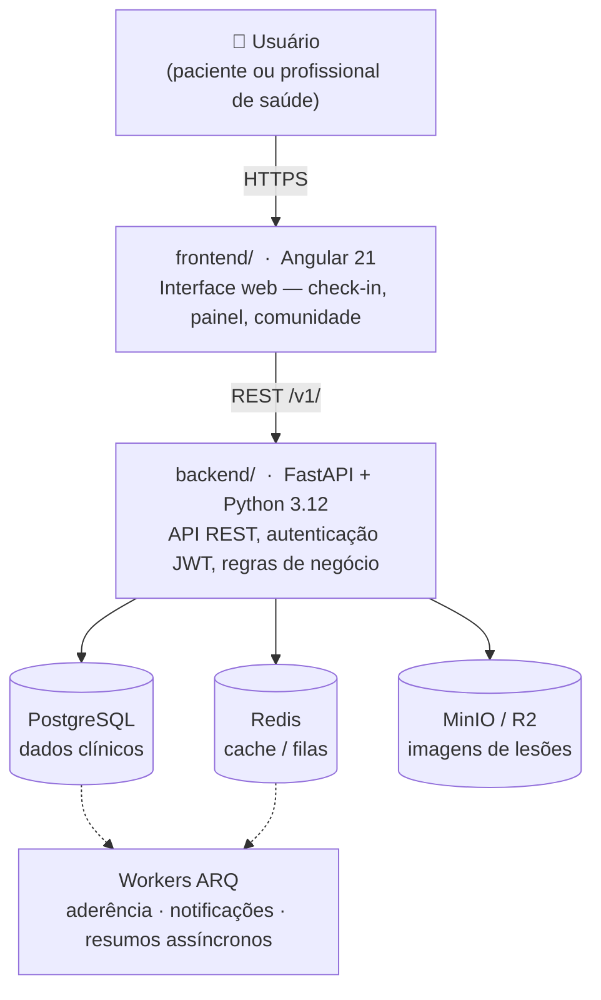

<br />

<table>
  <tr>
    <td valign="middle" width="140">
      
    </td>
    <td align="center">
      <h1>Pequi</h1>
      <p>Plataforma de acompanhamento de pacientes com hanseníase —<br />do check-in diário ao painel do profissional de saúde.</p>
      <p>Desenvolvido por alunos da <strong>Universidade Federal de Alagoas (UFAL)</strong>,<br />o Pequi conecta pacientes e profissionais de saúde em um único fluxo do registro diário de sintomas ao acompanhamento clínico especializado.</p>
      <a href="LICENSE"></a>
      <a href="CHANGELOG.md"></a>
      <a href=".github/workflows/ci.yml"></a>
    </td>
  </tr>
</table>

---

## Sobre o projeto

O Brasil registra historicamente um dos maiores números de casos novos de hanseníase do mundo. Apesar de ter cura, a doença exige tratamento prolongado — de seis meses a dois anos — e o abandono do tratamento é a principal causa de recidivas e de complicações que levam à incapacidade física permanente.

Pequi nasceu para reduzir esse abandono. O aplicativo permite que pacientes registrem sintomas e doses diárias de forma simples, enquanto profissionais de saúde acompanham a adesão, recebem alertas automáticos e se comunicam com suas equipes. A plataforma também oferece um espaço de comunidade anônima, onde pacientes podem compartilhar experiências sem expor sua identidade.

O projeto é desenvolvido como software de código aberto para unidades de saúde pública e organizações que atuam no combate à hanseníase no Brasil.

> [!NOTE]
> O objetivo do Pequi é apoiar o acompanhamento de pacientes com hanseníase, mas ele **não substitui avaliação médica profissional**. A plataforma foi projetada para auxiliar a adesão ao tratamento, o monitoramento clínico e a comunicação entre equipes de saúde, sempre respeitando princípios de privacidade, segurança da informação e conformidade com a LGPD.

---

## Para quem é este repositório

| Perfil | O que encontra aqui |
|---|---|
| Desenvolvedor novo | Instruções para subir o ambiente local do zero |
| Contribuidor | Como abrir um PR e onde está cada parte do código |
| Gestor de saúde / parceiro | Visão geral do produto e links para documentação detalhada |

---

## Arquitetura em alto nível



---

## Pré-requisitos

Antes de clonar o projeto, certifique-se de ter instalado:

| Ferramenta | Versão mínima | Uso |
|---|---|---|
| [Docker](https://docs.docker.com/get-docker/) | 24.x | Subir toda a stack (banco, cache, storage, API) |
| [Docker Compose](https://docs.docker.com/compose/) | v2.x | Orquestrar os serviços |
| [Node.js](https://nodejs.org/) | 20.x LTS | Desenvolvimento do frontend |
| [Python](https://www.python.org/) | 3.12+ | Desenvolvimento do backend |
| [UV](https://docs.astral.sh/uv/) | última versão | Gerenciador de pacotes Python |

> Para contribuições apenas no frontend, Docker + Node são suficientes.
> Para contribuições apenas no backend, Docker + Python + UV cobrem o essencial.

---

## Início rápido

### 1. Clone o repositório

```bash
git clone https://github.com/seu-org/pequi.git
cd pequi
```

### 2. Configure as variáveis de ambiente do backend

```bash
cp backend/.env.example backend/.env
# Edite backend/.env se necessário — os valores padrão já funcionam para desenvolvimento local
```

### 3. Suba a stack completa

```bash
cd backend
docker compose up -d
```

Isso inicia:
- `db` — PostgreSQL com PostGIS na porta `5432`
- `redis` — Redis na porta `6379`
- `minio` — armazenamento de objetos nas portas `9000` (API) e `9001` (console web)
- `migrate` — aplica as migrações Alembic automaticamente na primeira subida
- `api` — API FastAPI em `http://localhost:8000` (com hot reload)
- `worker` — processador de filas ARQ

Verifique se tudo subiu:

```bash
docker compose ps
```

A documentação interativa da API estará disponível em `http://localhost:8000/docs`.

### 4. Suba o frontend

Em outro terminal, a partir da raiz do repositório:

```bash
cd frontend
npm install
npm start
```

O app estará acessível em `http://localhost:4200`.

---

## Estrutura do repositório

```
pequi/
├── backend/          # API FastAPI, workers ARQ, migrações Alembic
│   ├── src/pequi/    # Código-fonte principal da aplicação
│   ├── tests/        # Testes unitários, de integração e E2E
│   ├── alembic/      # Migrações de banco de dados
│   ├── bruno/        # Coleções Bruno (contratos de endpoints)
│   └── scripts/      # Scripts de CI e utilitários de desenvolvimento
│
├── frontend/         # App Angular 21 (interface do paciente e do profissional)
│   └── src/          # Componentes, páginas e serviços Angular
│
├── docs/             # Documentação de produto: roadmap, épicos, milestones
│
├── .agents/          # Guias e workflows para agentes de IA e desenvolvedores
│
├── .github/
│   └── workflows/    # Pipelines de CI/CD (ci, build, lint, tests, release, security)
│
├── AGENTS.md         # Guia técnico principal do backend (convenções, camadas, LGPD)
├── CHANGELOG.md      # Histórico de versões (Keep a Changelog + SemVer)
└── LICENSE           # MIT
```

---

## Documentação detalhada

| Documento | O que cobre |
|---|---|
| [`backend/README.md`](backend/README.md) | Setup do backend, execução local, arquitetura em camadas, API, banco de dados, testes e observabilidade |
| [`AGENTS.md`](AGENTS.md) | Convenções de desenvolvimento, cadeia de dependências, padrões de código, LGPD, rate limiting e boas práticas para contribuidores e agentes de IA |
| [`frontend/README.md`](frontend/README.md) | Servidor de desenvolvimento Angular, scaffolding, build e execução de testes com Vitest |
| [`docs/ROADMAP.md`](docs/ROADMAP.md) | Visão de produto e entregas planejadas |
| [`CHANGELOG.md`](CHANGELOG.md) | Histórico de mudanças por versão |

---

## Como contribuir

1. Faça um fork do repositório e clone localmente.

2. Sincronize com a branch `development` antes de criar a sua:

```bash
git checkout development
git pull origin development
git checkout -b feature/minha-contribuicao
```

3. Implemente a mudança seguindo as convenções descritas em [`AGENTS.md`](AGENTS.md).

4. Rode lint e testes antes de abrir o PR:

```bash
# Backend
cd backend
uv run ruff check .
uv run ruff format --check .
scripts/run_tests.sh

# Frontend
cd frontend
npm test
```

5. Abra um Pull Request contra a branch `development` (não contra `main`). O pipeline [`ci.yml`](.github/workflows/ci.yml) roda automaticamente — o PR só pode ser mergeado com todos os checks passando.

6. Descreva claramente no PR o quê e por quê foi alterado. PRs focados (uma feature ou um fix) são revisados mais rapidamente.

> Dúvidas sobre o fluxo de branches? Consulte [`.agents/rules/gitflow.md`](.agents/rules/gitflow.md).

---

## Licença

Distribuído sob a licença MIT. Consulte o arquivo [`LICENSE`](LICENSE) para detalhes.

---

## Contato e mantenedores

* [Leila Biggi](https://github.com/lawtherea)
* [Lucas Heron](https://github.com/LukeHer0)
* [Matheus Ryan](https://github.com/TETEURYAN)
* [Rafael Luciano](https://github.com/rafaellucian0)
* [Sarah Domingos](https://github.com/sarahdomingos)

